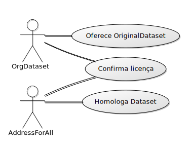
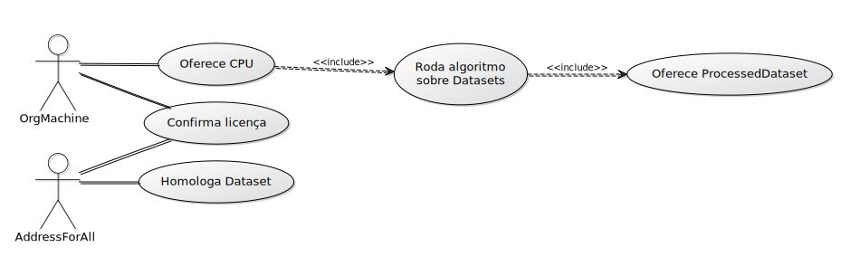

## Assets 
Figures, etc. at this folder, and below summary or specifications.

### fig01

UML Use Case of the actor "Organization of the Dataset donor". It is an https://schema.org/ArchiveOrganization
  


Builded with https://yuml.me
```
[OrgDataset]-(Oferece OriginalDataset)
[OrgDataset]-(Confirma licença)
[AddressForAll]-(Confirma licença)
[AddressForAll]-(Homologa Dataset)
```

## fig02
UML Use Case of the actor "Organization of the CPU-time donor". It is any https://schema.org/Organization


```
[OrgMachine]-(Oferece CPU)
(Oferece CPU)>(Roda algoritmo sobre Datasets)
(Roda algoritmo sobre Datasets)>(Oferece ProcessedDataset)
[OrgMachine]-(Confirma licença)
[AddressForAll]-(Confirma licença)
[AddressForAll]-(Homologa Dataset)
```
