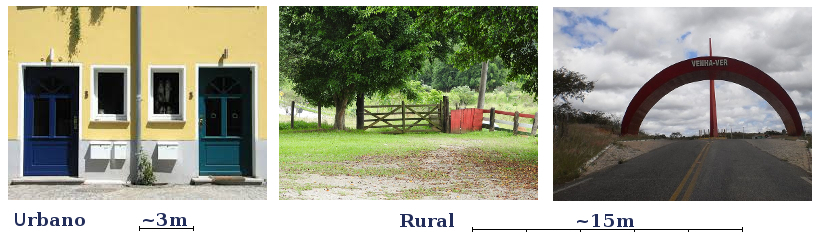
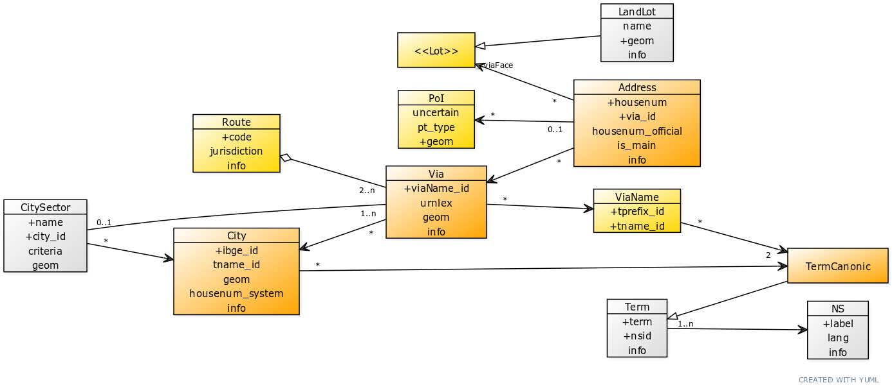
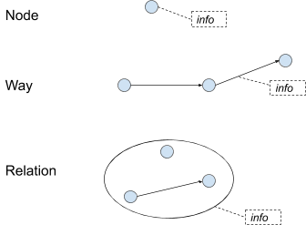
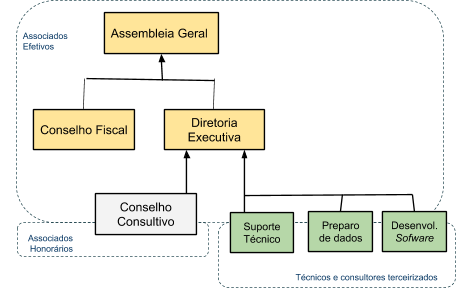
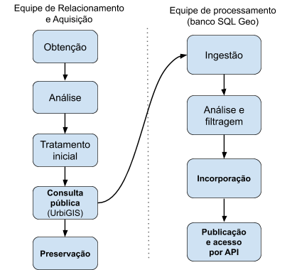
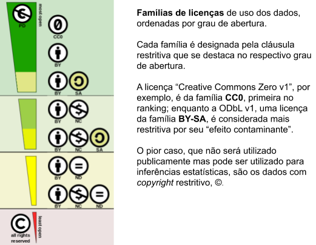
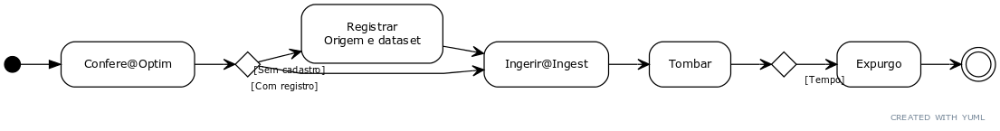

&#160;&#160;&#160; <code>urn:lex:br:associacao;dns-addressforall.org:norma.tecnica:2020;spec02;v0.2</code> &#160;&#160;&#160; (DOCUMENTO  PÚBLICO)

CONTEÚDO

&#160; [Ao leitor deste documento](#ao-leitor-deste-documento)
 &#160; [Apresentação](#apresentação)
 &#160; [Dados fundamentais](#dados-fundamentais)
 &#160; [Demais dados](#demais-dados)
 &#160; [Concepção de geometrias e layers na informação espacial](#concepção-de-geometrias-e-layers-na-informação-espacial)
 &#160; [Atores na metodologia e workflows](#atores-na-metodologia-e-workflows)
 &#160; [ESPECIFICAÇÃO](#especificação)
 &#160; [Spec02.1 - Workflow geral](#spec021---workflow-geral)
 &#160; [Spec02.2 - Workflow no servidor](#spec022---workflow-no-servidor)
 &#160; [Spec02.2.1 - Workflow na base Ingest](#spec0221---workflow-na-base-ingest)
 &#160; [Spec02.2.2 - Workflow no esquema StatCalc](#)
 &#160; [Spec02.2.3 - Workflow no esquema Optim](#)
 &#160; [Spec02.2.4 - Workflow de publicação](#h)

-----

# Ao leitor deste documento

O público-alvo deste documento é a equipe técnica do Instituto
AddressForAll. Evita-se, dentro do possóvel, o excesso de linguagem
técnica, para que equipe de gestão e membros efetivos do Instituto
também possam acompanhar a leitura, garantindo a adoção de uma
linguagem uniforme na governança dos processos técnicos.

É suposto que o leitor deste documento tenha familiaridade com a
[Spec01](https://www.google.com/url?q=https://docs.google.com/document/d/1gHOJbsQGA4Cy9vq5D8m96qLI5s45UsmusxQTSB-BTs4/&sa=D&ust=1594470371529000&usg=AOvVaw2VwNulN74FlX98Ow52YkiS), “Infraestrutura em nuvem”. Para as equipes de desenvolvimento de software e de suporte é suposto também que tenham acesso à Spec03.

O documento encontra-se em construção. Até a publicação da sua versão 1,
este documento permanece como documento interno em editor de texto; em
seguida ele será transformado em formato markdown e
[mantido](https://www.google.com/url?q=https://www.mkdocs.org/&sa=D&ust=1594470371530000&usg=AOvVaw22R7uytfZ2A2HAwmV4qNLi)
[online](https://www.google.com/url?q=https://www.mkdocs.org/&sa=D&ust=1594470371531000&usg=AOvVaw1lyIn3JQAitMG-9S6fIfSy) com
cópia [em
repositório](https://www.google.com/url?q=https://github.com/AddressForAll/specifications&sa=D&ust=1594470371531000&usg=AOvVaw3g7pZ9adrYie9C2l6kUmXB)
[git](https://www.google.com/url?q=https://github.com/AddressForAll/specifications&sa=D&ust=1594470371531000&usg=AOvVaw3g7pZ9adrYie9C2l6kUmXB)[ público](https://www.google.com/url?q=https://github.com/AddressForAll/specifications&sa=D&ust=1594470371532000&usg=AOvVaw04qSDZOi-4YffQVBSEml0m).

# Apresentação

A seguir a apresentação das abstrações e modelos mais gerais.

## Dados fundamentais

O Projeto AddressForAll tem como foco o dado de endedereço, dentro do
seguinte conceito:

Geograficamente, o endereço é a localização de uma moradia, local de
trabalho ou equipamento soicial. É um ponto geográfico aproximado, com
precisão suficiente para se localizar um “portão”.  
No meio urbano pode ser a porta de casa, a entrada principal de um
edifício, de um parque ou condomínio; e no meio rural pode ser a
porteira de acesso à propriedade rural, ou um marco de referência para a
via de acesso à vila rural.

É um conceito mais preciso e especializado, consistente com as noções
tradicionais de “endereço postal”, “endereço de entrega”, “entrada do
lote”, “centro da testada do lote”, etc. Também convencionamos que todas
as informações referentes ao endereço, ou seja, seus metadados, tais
como nome de rua, numeração predial, padrão para a nomenclatura da rua e
sistema de numeração predial, etc. são relativos à cidade, ou seja, são
contextualizados pela jurisdição municipal.

Convencionamos no Projeto que os dados são armazenados através de
tabelas de dados, ou seja, através do tradicional [modelo
relacional](https://www.google.com/url?q=https://en.wikipedia.org/wiki/Relational_model&sa=D&ust=1594470371533000&usg=AOvVaw0UEgJfyhhrYV1KyQ2yq5RH),
e sua especificação pode ser realizada através de abstrações de alto
nível, baseadas na [modelagem entidade-relacionamento
estendida](https://www.google.com/url?q=https://en.wikipedia.org/wiki/Enhanced_entity%25E2%2580%2593relationship_model&sa=D&ust=1594470371533000&usg=AOvVaw1mGGLWZBWyIZKmZ1Fuv63x). Nas
especificações técnicas de dados, portanto, serão mensionadas entidades
e suas propriedades e entidades e seus relacionamentos.  

Por ser um projeto internacional, convencionamos também que os nomes de
entidade e os nomes de propriedades (metadados ou descritores de colunas
nas tabelas de dados) são todos expressos na língua inglesa. Para
garantir a escolha de nomes padronizados com significados padronizados,
adotam-se os vocabulários semânticos
[SchemaOrg](https://www.google.com/url?q=https://schema.org/&sa=D&ust=1594470371534000&usg=AOvVaw20U3q9hyEdq4PnSORsogrb)
ou
[Wikidata](https://www.google.com/url?q=https://www.wikidata.org&sa=D&ust=1594470371534000&usg=AOvVaw2WdVonWwp5jBgZLBYZozu2),
com preferência pelos nomes de
[tag](https://www.google.com/url?q=https://taginfo.openstreetmap.org/&sa=D&ust=1594470371535000&usg=AOvVaw0fjFH7loOllHczHfe4QMfs)
[do
OpenStreetMap](https://www.google.com/url?q=https://taginfo.openstreetmap.org/&sa=D&ust=1594470371535000&usg=AOvVaw0fjFH7loOllHczHfe4QMfs) sempre
que possível.

Assim, endereço é a entidade Address, que como vimos acima não é
exatamente a entidade
[PostalAddress](https://www.google.com/url?q=https://schema.org/PostalAddress&sa=D&ust=1594470371536000&usg=AOvVaw2_41cPMSwDtln-ePXqShOO) do
vocabulário SchemaOrg, por isso também lançamos mão de um modelo de
dados que representa com mais precisão a semântica e os relacionamentos
adotados pelo projeto.  

Resumidamente, a informação do Address, mesmo estando distribuído por
várias tabelas, ou expressa estruturas não-tabulares, sempre poderá ser
expressa com as seguintes propriedades:

| (nome)      | [GeoURI](https://www.google.com/url?q=https://www.wikidata.org/wiki/Q5533943&sa=D&ust=1594470371537000&usg=AOvVaw39H6EyHkCI4SBU-IyNuJyF) | [streetName](https://www.google.com/url?q=https://taginfo.openstreetmap.org/keys/addr%253Astreet&sa=D&ust=1594470371538000&usg=AOvVaw24Rpev9ESj0XneHHJhtlDk) | [houseNumber](https://www.google.com/url?q=https://taginfo.openstreetmap.org/keys/addr%253Ahousenumber&sa=D&ust=1594470371539000&usg=AOvVaw2DhLfnHE2qHMHlwfVPHjqI) | [city\_id](https://www.google.com/url?q=https://schema.org/identifier&sa=D&ust=1594470371539000&usg=AOvVaw0FG5lLY6OA2DI3Tg5-Fd6r) |
| ----------- | ------------------------------------------------------------------ | ---------------------------------------------------------------------------------- | -------------------------------------------------------------------------------------------------- | -------------------------------------------------------------------------------------------------- |
| (descrição) | Coordenandas latLong                                                                                                                     | Nome de logradouro                                                                                                                                           | numeração predial                                                                                                                                                  | Código IBGE                                                                                                                       |
| (exemplo)   | \-23.561618,-46.655996                                                                                                                   | Av. Paulista                                                                                                                                                 | 1578                                                                                                                                                               | 3550308                                                                                                                           |

  
Conforme conceituação adotada, o endereço é relativo à “via de acesso à
casa”, ou seja, apesar de em português denominarmos “nome de
logradouro”, não pode ser um nome qualquer, tal como nome do edifício,
precisa ser um nome de via. No caso de nomes de rios, praias, praças,
etc. subintende-se “via principal” na margem do rio, no entorno da
praça, etc.

O logradouro também não pode ser confundido com a referência de
numeração predial. Por exemplo a quadra em Brasília, o código da
quadra não será considerado parte do nome de logradouro, será
considerado parte da numeração predial, na propriedade houseNumber.

## Demais dados

O banco de dados do projeto, para economizar espaço em disco e efetuar
melhor controle sobre os dados, armazena o streetName do Address em uma
entidade separada, denomiada entidade Via. Analogamente o código IBGE de
município, na propriedade city\_id, requer  uma entidade separada para
fornecer outros detalhes, tais como o nome da cidade e estado em que
está contida. Para isso foi definida a [entidade
City](https://www.google.com/url?q=https://schema.org/City&sa=D&ust=1594470371543000&usg=AOvVaw2A0DeiGqhikUO7Y6790tzN).

Estas e outras entidades, que ajudam a armazenar ou complementar a
descrição de Address, são definidas mais formalmente através do modelo
de dados, representado na forma de [diagrama de classe
UML](https://www.google.com/url?q=https://en.wikipedia.org/wiki/Class_diagram&sa=D&ust=1594470371544000&usg=AOvVaw2AlEt7BbQ-rsZKZOnA3EWg):

No modelo as entidaes em laranja escuro são as principais, em laranja
claro as secundárias, e em cinza as não-obrigatórias. As propriedades
recebem rótulo iniciado por letra minúscula, e as entidades por
maiúscula. Propriedades com “+” são chaves primárias. Resumidamente,
cada uma das entidades:

  - Address: o endereço e suas propriedades. Pode-se imaginar que todo
    endereço é relativo a um Lot, e esse lote tem acesso por uma Via. A
    representação geográfica do endereço fica por conta de um ou mais
    pontos (POI) fornecidos como supostas “posições de porta” ou centros
    de “testada de lote”.  
    Nota: o sub-endereço de imóveis dentro de lotes, tais como
    apartamentos, não é considerado.
  - Via: tipicamente uma rua, com marco zero bem definido, de modo que
    as numerações prediais (houseNumber) dos diversos Address
    relacionados façam sentido e possam ser localizados sobre a
    geometria (geom) da linha central que define espacialmente a via.
    Ela tem os seus limites restritos ao município (City).  
    Nota: a entidade Via está fundamentada na “via pública” e no
    “endereço horizontal”. O Projeto não prioriza a gestão de dados
    relativos a vias no interior de condomínios e fazendas privadas.
  - City: município oficialmente definido, portanto portador de código
    IBGE (code), com limites territoriais oficalmente definidos em mapa
    (geom) e outras informações (info).
  - TermCanonic: termo canônico indexado, para que nomes, nomes
    aproximados e abreviações resultem no mesmo nome de cidade ou nome
    de rua, etc. No caso de Via são dois termos, o tipo de logradouro e
    o nome do logradouro, por isso a intermediação por ViaName (em
    cidades diferentes pode reusar por exemplo “Avenida Getúlio
    Vargas”).
  - POI: ponto de interesse (Point of Interest), determinado por
    [GeoURI](https://www.google.com/url?q=https://en.wikipedia.org/wiki/Geo_URI_scheme&sa=D&ust=1594470371545000&usg=AOvVaw32xakGJMkFSIxiIBDJ9muQ),
    ou seja por coordenadas padronizadas de latitude e longitude (geom),
    e opcionalmente a incerteza de localização (uncertain).  
    No modelo são previstos também pontos que não são de endereçamento
    (pt\_type).  
    Um Adress necesariamente terá um POI, mas pode ser mais de um, pois
    diferentes fontes de informação podem determinar pontos ligeiramente
    diferentes para o mesmo endereço, cabendo a decisão final à análise
    estatística, ou agrupamento por elevação da incerteza quando forem
    próximos.
  - Route: estradas federais e estaduais (conforme jurisdiction) são
    compostas de segmentos dados pelas geometrias de Via municipais. No
    Brasil cada rota tem seu código (code), por ex. “BR-116”.
  - CitySector: entidade opcional, para registrar nome e geometria de
    bairro ou distrito, relevante em particular nas capitais e grandes
    cidades, onde é mais comum surgirem valores duplicados para a
    propriedade name da entidade Via. Em cidades pequenas podem ser
    convencionados setores artificais, tais como os quadrantes de
    Geohash que contém a cidade, um ao norte (setor “N”) outro ao sul
    (“S”).  
    Nota: o campo Address.info comporta CEP, é mais confiável do que
    nome de bairro.  
  - Lot: entidade abstrata, definida apenas para lembrar que o endereço
    está associado a um [lote de
    terra](https://www.google.com/url?q=https://en.wikipedia.org/wiki/Land_lot&sa=D&ust=1594470371547000&usg=AOvVaw3jW9eZOoYXN65oFjsgaJ09),
    mesmo que imaginário e sem informações oficiais. Lotes não precisam
    respeitar as fronteiras entre municípios, apesar da cobrança de IPTU
    exigir desmembramento da sua geometria para este fim.
  - LandLot: entidade opcional. Quando existem dados oficiais, podem ser
    cadastrais (por ex. o Parque Ibirapuera tem diversos descritores em
    info) e/ou sua delimitação geográfica (geom).
  - ViaName, Term e NS: complementos da modelagem terminológica.

------

## Concepção de geometrias e layers na informação espacial

A interoperabilidade dos dados espaciais é garantidade através do
formato
[GeoJSON](https://www.google.com/url?q=https://en.wikipedia.org/wiki/GeoJSON&sa=D&ust=1594470371548000&usg=AOvVaw2SI9gFJ-4pRbVPAXidPhLq) e
do modelo de dados adotado pelo OpenStreetMap (OSM). O [modelo de dado
OSM](https://www.google.com/url?q=https://wiki.openstreetmap.org/wiki/OSM_XML&sa=D&ust=1594470371549000&usg=AOvVaw0svRhkR-_Exc4F9nYPtoje) faz
uso apenas 3 elementos estruturais:  
nodes, ways e relations.

Ao lado, em azul, são ilustrados pontos geográficos.

O conceito OSM de Node corresponde a um ponto e suas informações. As
tags do OSM são representadas no  GeoJSON como objetos JSON, sob o campo
properties — na ilustração como info.

No OSM uma linha geométrica é uma Way, que também comporta suas tags
dentro de info.  
Por fim os conjuntos de Way’s, Way’s e pontos ou polígonos (Way’s com
loops), são espacialmente agrupados como Relation.

A entidade Via do modelo AddressForAll pode ser representada como Way,
enquanto a entidade City como Relation.

Ao contrário dos modelos tradicionais adotados em SIG, não existe o
conceito de camada. Elas podem ser inferidas a partir das tags OSM
(info), que é o meio adotado para a inclusão de dados cadastrais e
tipologia das geometrias. Por exemplo, quando o XML é convertido para
PostGIS através da aplicação osm2pgsql, parte das ways são classificadas
como roads, ou seja, são supostas como geometrias de Via.

No Projeto AddressForAll foi também adotado o PostGIS, mantendo em geral
a representação geométrica e de atributos proveviente do
OpenStreetMap.

## Atores na metodologia e workflows

A gestão do dia a dia do Instituto AddressForAll é mantida através de
seus órgãos colegiados: o Conselho Fiscal (CFis) e a Diretoria Executiva
(DExe).

A coordenação das equipes técnicas, compostas na sua maior parte de
terceiros, fica a cargo da DExe.

A equipe de Suporte cuida principalmente da da instalação e manutenção
do servidor Web, e a equipe de desenvolvimento desenvolve e mantém o
site e o software do sistema, hospedados no servidor Web.

Na equipe de Preparo de dados é que se encontram os principais atores do
workflow. As prefeituras e outras entidades ou empresas
fornecedoreas/doadoras de dados entram em contato com a DExe da
AddressForAll (ou sua equipe de marketing/relacionamento) que, uma vez
fornecendo dados passam a se relacionar com a equipe de “Relacionamento
e aquisição”, que faz parte da equipe de Preparo de dados.

-----

# ESPECIFICAÇÃO

Especificação técnica do modelo de dados contextualizada pelas
especificações de arquitetura, casos de uso e de workflow.

## Spec02.1 - Workflow geral

Etapas do processo de prospecção e aquisição dos dados de endereços e
vias no AddressForAll.

O diagrama ao lado apresenta de forma grosseira o fluxo de dados que
acompanha o fluxo de trabalho.

As etapas realizadas pela Equipe de Relacionamento (atualmente Thierry e
Igor) são realizadas sem necessidade de infraestrutura especial, fazem
uso de ferramentas usuais para a gestão de contatos (CRM), comunicação
formal (e-mail), e armazenamento temporário em núvem, em particular
dados já tratados ficam visíveis na plataforma UrbiGIS, até que se
confirme o atestado de licença de uso dos dados cedidos.

As etapas realizadas pela Equipe de processamento são semi-automáticas
(assistidas por computador). Durante a etapa de análise em banco de
dados é realizada também a validação dos mesmos. Dados filtrados por
motivo de falha podem ser informados ao cedente/doador para que este
revise ou atualize.

-----

Etapas na Equipe de Relacionamento e Aquisição

<table>
<colgroup>
<col style="width: 50%" />
<col style="width: 50%" />
</colgroup>
<tbody>
<tr class="odd">
<td>
Etapa 1 – Obtenção

<ul>
<li>Obtenção ativa ou passiva: a AddressForAll contata prefeituras e concessionárias, ou recebe solicitação.</li>
<li>Identifica contatos interessados (e-mail enviado por Thierry/equipe para a pessoa);</li>
<li>Call Center liga de novo para verificar;</li>
<li>Obtemos o material fornecido pelo interessado, e a sua entidade (ex. prefeitura) passa a se caracterizar como doador/cedente.</li>
</ul>

Etapa 2 – Análise de material

<ul>
<li>(se contém endereços) Verificação se o material contém informação útil;</li>
<li>(Se não) comunica-se o cedente avisando e orientando.</li>
<li>Verificação da compatibilidade da licença (maior parte “implícita CC0”);</li>
<li>Armazenamento da licença com prova digital na <a href="https://www.google.com/url?q=http://uniproof.com.br&amp;sa=D&amp;ust=1594470371554000&amp;usg=AOvVaw3iVGNZPMNvqyF1gbElmCo1" class="c13">Uniproof</a>;</li>
<li>Avaliação inicial do material para classificação e tratamento (2h no máximo).</li>
</ul></td>
<td>
Etapa 3 – Tratamento inicial e Teste

<ul>
<li>Para cada tipo de arquivo constatado na classificação, haverá um tipo de tratamento.</li>
<li>O tratamento consiste no processo de manipulação dos arquivos brutos para convertê-los e extrair deles os dados úteis que são os endereços geoposicionados.</li>
<li>O produto final é um ou mais arquivos no formato CSV que conterão os endereços geoposicionados, conforme o padrão AddressForAll definido.</li>
</ul>

Etapa 4 – Arquivamento para preservação

Serão arquivados no repositório do AddressForAll: 1. o material recebido sem alteração e que não foi rejeitado; 2.  o produto final, isto é, os arquivos CSV dos endereços geoposicionados.
</td>
</tr>
</tbody>
</table>

## Spec02.2 - Workflow no servidor

Os dados ficam encapsulados por SQL schemas ou SQL databases, conforme
perfil. São previstos quatro “cápsulas de dados” em função do workflow:

<table>
<colgroup>
<col style="width: 50%" />
<col style="width: 50%" />
</colgroup>
<tbody>
<tr class="odd">
<td>
Cápsula e sua descrição
</td>
<td>
Preservação, licenças e segurança
</td>
</tr>
<tr class="even">
<td>
1. Ingest: modelo de dados adequado ao processo de ingestão. Traz o dado externo (ex. ruas e pontos da prefeitura) para o formato padronizado, pois a inserção no Statcalc é gradual e homologada por humano.
</td>
<td><ul>
<li>Tempo de residência limitado;</li>
<li>Dados abertos e software aberto;</li>
<li>Backup externo (preservação do original e do algoritmo de conversão);</li>
<li>Encapsulamento por base e permissão para grupos ingest.</li>
</ul></td>
</tr>
<tr class="odd">
<td>
2. StatCalc: modelo esparso para realizar todas as estatísticas. Pontos de diferentes origens, tais como prefeitura, OSM, IBGE, etc. nomes de rua, linhas representando vias, etc. de todas as origens, algumas sobrepondo-se outras não... Tudo solto para fazer estatísticas e concluir o que é melhor. 
É onde mais gastaremos disco.
</td>
<td><ul>
<li>tempo de residência longo indeterminado 
(só  sai se o dado for contestado);</li>
<li>dados mix (abertos e fechados) 
e software fechado/estratégico;</li>
<li>backup de segurança.</li>
<li>Encapsulamento por schema, acesso restrito a associados.</li>
</ul></td>
</tr>
<tr class="even">
<td>
3. Optim: modelo final compacto e otimizado para consultas. Endereços amarrados com ruas e cidades, tudo consistente e fazendo uso do que foi eleito como "melhores dados" ou médias. Tudo sujeito a mudança caso mudemos os algoritmos ou parâmetros estatísticos numa versão seguinte. No Optim são também mantidos os dados cadastrais dos datasets originais, suas licenças, etc. compartilhados com StatCalc.
</td>
<td><ul>
<li>tempo de residência médio 
(renova com versão stable);</li>
<li>dados mix (abertos e fechados) 
e software mix.</li>
<li>Encapsulamento por schema, permissão para grupos DataScience.</li>
<li>A exportação para backup permanente e versões estáveis em GeoJSON também tem origem aqui.</li>
</ul></td>
</tr>
<tr class="odd">
<td>
4. Deliv: entrega dos dados aos usuários finais, namespace e funções padronizadas para a exposição em serviços através da API do PostgREST.
</td>
<td><ul>
<li>sem dados (apenas views e funções);</li>
<li>Encapsulamento por schema, permissão para grupos WebDevelop.</li>
</ul></td>
</tr>
</tbody>
</table>

Comentando cada cápsula, para seu entendimento do ponto de vista
estratégico.

A base de dados SQL Ingest é aberta para comunidade participar da
discussão e contribuir. O processo de ingestão é o input, ou seja, não
publicamos nada, apenas recebemos. Publicamos o software, para destacar
os padrões adotados e a reproducibulidade a partir dos dados
preservados,  e talvez alguns datasets de referencia, tais como por
exemplo para [nomes de
municipios](https://www.google.com/url?q=http://datasets.ok.org.br/city-codes&sa=D&ust=1594470371563000&usg=AOvVaw0-FE72xOzd3N2pjyJ6W1j6).

Alguns dados, por exemplo de prefeituras que ainda não homologaram, ou
de empresas privadas, não passam pelas etapas públicas, e se mantém com
acesso restrito ao longo de todo o processo, inclusive na API, que seria
diferenciada para poder levar em conta as inferências estatísticas
baseadas também nestes dados, e não apenas nos dados públicos.

O SQL schema Statcalc, em base de dados segura e de acesso mais
restrito, com software privado (menos código aberto), requer
investimento maior do Instituto no seu desenvolvimento. Com isso
Statcalc pode ser considerado também ativo intangível do Instituto.

O SQL schema Optim, ainda em base de dados segura e de acesso restrito,
como Statcalc, pode ser segmentado em dois, Optim-público e
Optim-privado. O público justamente é o que pode ser publicado em git,
distribuído com licenças abertas, etc.

Uma boa parte da estrutura de dados da Optim (e indiretamente seu
software), é comum a ambos esquemas, pois o Optim-público define o
modelo de interoperabilidade interno do Instituto e externo para as
prefeituras.

Ao ser publicado, Optim-público discrimimina a licença de cada registro.
Em particular, e importante, se um mesmo dado tem diversas origens com
diferentes licenças, publica-se com a licença mais aberta. (ilustração).

Por exemplo se o mesmo dado de endereço teve origem na Wikidata, nos
Correios e no OSM, podemos publicar com a licença explicita menos
restritiva, ou seja, CC0, mesmo que outras fontes sejam restritivas.

Essa forma de publicação, com todos os dados rastreáveis, será a nossa
grande contribuição para a comunidade difusa (dados abertos).

O SQL schema Delivery tem especificação pública e código opcionalmente
fechado. Como o próprio SQL schema conrresponde às API's, essa parte do
software se torna ativo intangível do Instituto.

...

### Spec02.2.1 - Workflow na base Ingest

O fluxo de dados segue o workflow:

Pode ser lido da seguinte forma: na cápsula Optim conferir se o dataset
foi registrado, efetuando cadastro se necessário. Na cápsula Ingest:
ingerir, tombar e, depois que contabilizado o tempo de residência,
expurgar.

### Spec02.2.2 - Workflow no esquema StatCalc

### Spec02.2.3 - Workflow no esquema Optim

### Spec02.2.3 - Workflow de publicação

Registros em git e cartório... cada versão Stable.
